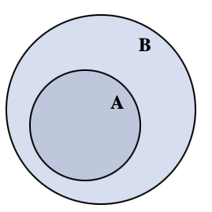

## Index
---

- [추상화](#추상화--abstract)
- [부품화](#부품화)
- [은닉화, 캡슐화](#은닉화-캡슐화)
- [인터페이스](#인터페이스)
- [리팩토링](#리팩토링)
- [클래스와 인스턴스 그리고 객체](#클래스와-인스턴스-그리고-객체)
- [this](#this)
- [클래스 멤버 인스턴스 멤버 그리고 static, dynamic](#클래스-멤버-인스턴스-멤버-그리고-static-dynamic)
- [클래스 함수 ( 클래스 메서드 )](#클래스-함수--클래스-메서드)
- [static field, non static field](#static-field-non-static-field)
- [유효범위 ( Scope )](#유효범위--scope)
- [생성자 ( Constructor )](#생성자--constructor)
- [상속](#상속)
- [생성자](#생성자)
- [super](#super)
- [override](#override)
- [overloading](#overloading)
- [컴파일과 클래스](#컴파일과-클래스)
- [classpath](#classpath)
- [환경변수](#환경변수)
- [패키지](#패키지)
- [API](#API)
- [접근 제어자](#접근-제어자)
- [클래스 접근제어자](#클래스-접근제어자)
- [abstract](#abstract)
- [다지인 패턴](#다지인-패턴)
- [interface](#interface)
- [다형성](#다형성)
- [예외](#예외)
- [finally](#finally)
- [예외 던지기](#예외-던지기)
- [throws 책임의 전가](#throws-책임의-전가)
- [예외 만들기](#예외-만들기)
- [checked & unchecked Exception](#checked-&-unchecked-Exception)
- [object](#object)
- [finalize](#finalize)
- [가비지 컬렉션 ( garbage collection )](#가비지-컬렉션-(-garbage-collection-))
- [clone](#clone)
- [enum](#enum)
- [enum과 생성자](#enum과-생성자)
- [복제](#복제)
- [참조 ( reference )](#참조-(-reference-))
- [제네릭](#제네릭)
- [Collections Framework](#Collections-Framework)
- [ArrayList](#ArrayList)
- [HashSet](#HashSet)
- [Iterator](#Iterator)
- [Map](#Map)
- [HashMap](#HashMap)
- [List-정렬](#List-정렬)
---


- 객체 지향 프로그래밍 ( OOP: Object Oriented Programming )
- **JAVA는** 다른 언어와 다르게 **객체 지향을 사실상 강제한다** ( 라고한다. 공부하다보면 알게 될지도 )

## 추상화 ( Abstract )

- 객체의 대표되고 공통되는 속성과 행위들을 추출하여 정의 내리는 것
    - 컴퓨터라는 객체의 모니터, RAM, SSD, HDD 라는 공통되는 것을 추출하여 컴퓨터를 추상화


## 부품화

- 결함이 있을 때에 분리가 되어 있지 않다면 전체가 영향을 받게 된다. 하지만 부품화가 잘 되어있는 경우 해당 부품만 교체하면 문제가 해결이 되는 장점이 있다
- 객체 지향은 부품화의 정점이라 할 수 있다

## 은닉화, 캡슐화

- 부품의 내부의 동작 과정, 방법은 숨긴채 사용자에게는 부품의 사용 벙법만을 노출
    - 모니터가 어떻게 화면을 출력하는지는 모르지만 사용자는 모니터에 파워를 넣고 컴퓨터에 연결을 하면 사용 할 수 있다는 것만 알면 된다
- 객체 내부에는 어떤 메소드가 있고 어떠한 입출력을 갖고 어떻게 동작하는지는 알려주지 않지만 객체를 사용가능 하도록 하는 것

## 인터페이스

- 잘 만들어진 부품이라면 같은 부품끼리는 서로 교환이 가능해야한다
    - 컴퓨터에 A사 모니터와 B사 모니터 모두가 연결되어야 한다
    - 모니터와 컴퓨터를 연결하는 케이블의 규격이 표준화 되어 있어야 한다
    - 모니터와 컴퓨터의 연결점을 **인터페이스** 라고 한다
- 인터페이스는 부품들 간의 규격을 소프트웨어적으로 구현된 것

## 리팩토링

- 기존의 코드와 동일하게 동작하지만 코드 내용을 개선하여 코드를 효율적으로 만드는 행위
- 자주 리팩토링을 거친 코드는 건강한 코드가 되고 건강한 코드일 수록 변화에 유연하게 대처가 가능하고 버그를 만들 확률이 낮아진다

## 클래스와 인스턴스 그리고 객체

- 어떠한 **객체**를 [추상화](#추상화--abstract) 시키면 **클래스** 그것을 구체화 하면 **인스턴스**
    - 고양이라는 객체를 추상화 시킨다 -> 클래스 생성
        - 고양이의 공통, 특징되는 속성을 뽑아 설계도 생성
        ex) 외형 선택 - 얼룩냥이, 치즈냥이
    <br>

    - 고양이 클래스를 구체화 -> 인스턴스 생성
        - 치즈냥이, 얼룩냥이 생성  
    <br>

    - 고양이라는 객체를 분석해서 설계도를 만들고 그 설계도를 통해 고양이를 구현
    - 고양이라는 객체를 추상화하여 클래스를 생성하고 클래스를 통해 인스턴스 생성

```JAVA
// 고양이라는 객체를 추상화하여 클래스를 생성
public class Cat {
    ...
}

public static void main(String[] args){

// Cat 이라는 데이터 타입의 cheese라는 변수에 Cat 클래스를 인스턴스화
// Cat 이라는 데이터 타입의 spot라는 변수에 Cat 클래스를 인스턴스화
    Cat cheese = new Cat('치즈냥이');
    Cat spot = new Cat('얼룩냥이');
}
```

## this

- 자기 자신의 클래스를 의미
- 클래스 내부의 함수에서 선언한 지역변수와 클래스 변수와 변수명이 동일 할 때에 this 를 통해서 지역변수가 아닌 전역변수인 클래스 변수를 사용한다고 명시해 주는 역할
---

**아직 [this](#this) 와 [static field, non static field](#static-field-non-static-field) 개념을 배우지 않았을 때 적었던 내용**

- [인스턴스](#클래스와-인스턴스-그리고-객체) 생성 후 해당 인스턴스 내부에 변수의 값을 초기화 또는 변경 할 때에 함수의 파라미터를 통해 값을 넘긴 후 this.변수명을 통해 데이터를 넣어 준다

 this 를 사용하는 이유는 보통 함수의 파라미터 명과 클래스의 변수명을 동일하게 설정하는데 이 때 함수 내부의 지역변수가 클래스 변수보다 우선 순위로 설정이 되어 클래스 변수의 값이 변경되지 않는다 그래서 this 를 통해 명시해주는 것

```JAVA
class Test{
    int a;
    // self.a   // Python 사용 시 인스턴스 고유 변수라면
                // __init__ 선언 후 self 를 붙인 채 생성을 했었던 거 같은데...

    public void setA(int a){
        // this.a = a;
        // a = a;
    }

    public void printA(){
        System.out.println(this.a); // 2 출력
        System.out.println(a);      // 오류가 날 줄 알았지만 2 출력
    }
}

public class MyApp {
    public static void main(String[] args){
        Test test = new Test();
        test.setA(2);
        test.printA();
    }
}
```

- JAVA 의 this와 Python 의 self 가 비슷 한 거 같은데...  
Python 은 함수 내부 지역변수가 아닌 함수 외부 class 변수일 경우 self 를 사용하지 않으면 error 가 출력이 되지만  
JAVA 에서는 함수 파라미터의 변수명과 클래스의 변수명의 같은 경우 this 를 통해 지역변수가 아니고 클래스 변수인 것만 명시 해주면 클래스 변수의 데이터가 바뀐다  
심지어 클래스 변수명과 함수 파라미터의 변수명이 다르다면 this 마저 사용하지 않아도 된다 마치 클래스에서 선언된 변수는 전역변수인 것처럼 동작한다 ( 이유: [static field, non static field](#static-field-non-static-field) )  
물론 Python JAVA 가 이렇게 설계가 된 것인지 혹시, 에디터에서 지원하는 편의 기능인지는 모른다 ( Python: vscode, JAVA: intelij 이다 )

## 클래스 멤버 인스턴스 멤버 그리고 static, dynamic

- 클래스 멤버
    - 같은 클래스를 가진 인스턴스라면 서로 공유를 하게되는 데이터
    - 같은 클래스에서 생성된 두개의 인스턴스가 있을 때에 한 인스턴스에서 변수의 값을 변경하면 나머지 인스턴스의 같은 변수명을 가진 ( static ) 데이터의 값도 변하게 된다
- 인스턴스 멤버
    - 같은 클래스 다른 인스턴스와는 공유하지 않는 본인 인스턴스 고유로 갖게되는 데이터
    - 같은 클래스에서 생성된 두개의 인스턴스에서 한 인스턴스의 변수 값을 변경 시 다른 인스턴스에서는 변경이 되지 않는 자기만의 고유 데이터

- 클래스 멤버의 경우 정적인 ( static ) 을 통해 생성
- 인스턴스가 아닌 클래스 명을 통해서 변수에 접근 ( Test.class_variable = 100 )
- 인스턴스 멤버의 경우 동적 ( dynamic ) 이 default 로 설정되어 있어 static 인 경우에만 명시해주면 된다

```JAVA
class Test {
    static int class_variable = 0;  // 클래스 멤버
    int instance_variable = 1;      // 인스턴스 멤버
}

public static void main(String[] args){
    Test t1 =  new Test();
    Test t2 =  new Test();

    System.out.println(t1.instance_variable);   // 1
    t1.instance_variable = 10;
    System.out.println(t1.instance_variable);   // 10
    System.out.println(t2.instance_variable);   // 1 t1 에서만 변경 t2 와 관계 없다

    t1.print_class_variable();  // 0
    Test.class_variable = 100;  // 인스턴스가 아닌 클래스 명을 통해서 변수에 접근
    t1.print_class_variable();  // 100
    t2.print_class_variable();  // 100
                                // 같은 클래스의 인스턴스끼리는 공유하는 값이기 때문에 둘 다 바뀜
}
```

## 클래스 함수 ( 클래스 메서드 )

계산기라는 클래스에서 연산을 할 때에는 연산자 함수를 호출하고 파라미터로 좌항과 우항의 값을 넘겨주면 된다 이는 인스턴스를 굳이 생성해서 할 필요가 없다는 뜻이다  
인스턴스를 생성시 메모리를 추가적으로 소비하게 되고 속도적 측면에서도 손해임으로 클래스 명을 통해 클래스에 직접 접근해서 사용하는게 이득이다

```JAVA
Calculator.sum(10, 20);
```

## static field, non static field

- 클래스 메소드와 인스턴스 메소드 간의 접근
    - 인스턴스 메소드를 통해 클래스 멤버에 접근이 **가능하다**
    - 클래스 메소드를 통해 인스턴스 멤버에 접근이 **불가능하다**
<br>

- 클래스 자체 변수인 static 클래스 변수는 클래스와 동시에 생성되는 반면에 인스턴스 고유 변수인 dynamic 변수는 인스턴스 객체가 생성되어 메모리에 올라오는 순간 생성이 된다
- 인스턴스 메소드는 인스턴스가 생성 이전부터 존재하던 클래스 멤버에 접근이 가능 - static, non static field 모두 접근 가능
- 하지만 클래스 멤버 생성 당시에는 인스턴스가 생성이 되지 않은 상태임으로 오직 static field 에만 접근이 가능한 상태
- 심지어 클래스 메소드는 static feild 만 접근 가능하도록 **정의 되었기 때문에** 인스턴스가 생성된 이후라도 non static feild 에는 접근이 불가능 하다

A = static field ( 클래스 멤버 )  
B = non static field ( 인스턴스 멤버 )



## 유효범위 ( Scope )

- 클래스의 서로 다른 함수에서 선언된 변수의 이름이 서로 같더라도 변수의 유효범위가 다르기 때문에 값에 영향을 끼치지 않는다 ( 동명이인과 같이 단지 이름이 같은 것 )
- [this](#this) 를 통해 클래스 자체 전역변수와 함수 내부의 지역변수 명이 같을 경우 this 앞에 붙여 지역변수가 아닌 전역변수를 사용한다고 명시
<br>

- 클래스 내부에서 선언된 변수 **전역변수**
- 클래스 내부의 함수에서 선언된 변수 **지역변수**
<br>

- 함수의 로직에서 전역변수를 사용할 경우 부품의 관점에서 클래스의 의존성이 너무 커지게 되는데, 이는 객체의 크기가 커짐을 의미하고, 곧 서로간의 연관성이 상승함으로 또 다시 복잡함의 상승을 불러일으키고, 결국 관리의 이슈를 생성하게 됨으로 전역변수를 사용하는 것보다 파라미터를 통해 독립적으로 작동하는게 좋다

## 생성자 ( Constructor )

- 인스턴스 객체를 생성할 때에 초기에 파라미터를 받아오는 과정을 추가해 준다

기존에 계산기라는 인스턴스 객체를 생성한 후에 더하기 라는 함수를 호출하며 파라미터를 입력하였다면 생성자를 사용한다면 객체를 생성과 동시에 값을 받아오고 파라미터 없이 함수만 호출하여 기존에 입력 받았던 값으로 계산

```JAVA
// 기존 방법
    Calculator cal1 = new Calculator();
    cal1.sum(10, 20)    // 30
    
// 생성자 사용
    Calculator cal2 = new Calculator(10, 20);
    cal1.sum()    // 30
```

## 상속

- 어떠한 객체가 기존에 이미 존재하는 객체의 변수 함수를 물려 받아와 추가로 본인의 변수 함수를 추가하거나 상속받아 온 것을 본인에 맞게 변경해서 사용하는 것
- 기존의 객체를 그대로 유지하면서 어떠한 기능을 문제 없이 추가 할 수 없을까 하는 고민에서 나온 방법
- 한 명의 자식 클래스는 오직 한 명의 부모 클래스만 가질 수 있다.
- **상속의 효용성**
    - 기존의 사용하던 함수를 내 입맞에 맞게 수정을 하려 하는데 같은 프로그램 내의 사용중인 다른 곳에서 까지의 영향을 미치게 되는 것을 막아준다
- 부모 클래스와 자식클래스의 관계를 상위 ( super ) 클래스 하위 ( sub ) 클래스로 표현
- 하위 클래스가 인스턴스화 될 때에 하위 클래스의 생성자가 동작하기 이전에 부모 클래스의 생성자를 먼저 호출 후 부모 클래스를 먼저 정의하도록 정의되어 있다

- a <- b
    - a = 부모 b = 자식
    - b 는 a 를 상속한다, 확장한다
 
 - 인스턴스를 통해 함수를 호출 했을 떄 함수가 클래스 내부에 없는 경우 상속 받은 클래스를 확인 한다

 ## 생성자

- 클래스를 정의 할 때에 소괄호 () 를 통해 매개변수를 받지 않는다. 하지만 JAVA 는 자동으로 기본 생성자를 만들어주는데 이는 클래스와 이름이 같고 매개변수가 없으며 매서드 내부는 비어있다
- test 라는 인스턴스 객체를 생성 할 때에, new TestClass 를 통해 객체를 생성 하는데, 이 때 자바가 자동으로 생성해준 생성자를 통해 객체를 생성한다

```JAVA
public class TestClass {
    public static void main(String[] args) {
        TestClass  test = new TestClass();
    }
}
```

- 기본 생성자가 아닌, 사용자가 매개변수를 가지는 생성자를 생성하는 경우, new 를 통해 클래스를 인스턴스화 시킬 때에 규칙 미준수시 Error 발생
    - 사용자가 생성자를 명시하는 경우 JAVA 는 기본 생성자를 만들어 주지 않음
    - TestClass 생성자의 파라미터로 int 형 정수를 정의 하였지만 파라미터로 아무 값을 넘기지 않고 있기 때문에 Error 발생
        - 사용자가 생성자 명시를 할 경우 기존의 파라미터를 넘겨받지 않는 JAVA 자동 생성 생성자가 없기 때문
    - 파라미터를 넘기지 않고도 Error를 발생 시키지 않으려면 파라미터를 받지 않겠다는 것을 따로 명시 해야한다

```JAVA
public class TestClass {
    public TestClass(int param1) {}

    public static void main(String[] args) {
        TestClass  test = new TestClass();      // int형 파라미터를 넘기지 않기 때문에 에러 발생
    }
}
```

```JAVA
public class TestClass {
    public TestClass() {}               // 파라미터를 받지않는 경우 추가 ( 에러 발생 X )
    public TestClass(int param1) {}

    public static void main(String[] args) {
        TestClass  test = new TestClass();      // 파라미터를 받지않는 생성자가 있기 때문에 에러 발생 X
        TestClass  test2 = new TestClass(2);    // int 형 변수를 넘겨받는 생성자가 있기 때문에 에러 발생 X
    }
}
```

- 하위 클래스가 인스턴스화 될 때에 하위 클래스의 생성자가 동작하기 이전에 부모 클래스의 생성자를 먼저 호출 후 부모 클래스를 먼저 정의하도록 정의되어 있다
    - 상위 클래스에서 사용자 정의 생성자가 있는 경우 하위 클래스에서 파라미터 없는 인스턴스를 생성시 오류 발생
    - 하위 클래스 생성자 호출 이전에 상위 클래스에서 생성자가 선 호출되어야 하는데 파라미터 값이 넘어오지 않았기 때문
        - 위의 예시와 같이 파라미터를 받지 않는 경우를 추가해 주면 해결
        - 또는 [super](#super) 와 같이 하위 생성자에서 상위 생성자를 상속 받을 수 있다

## super

- 하위 클래스와 상위 클래스의 생성자의 하는 역할이 같다면 super을 통해 부모 생성자의 생성자를 상속 받아올 수 있다.
- super = 부모 클래스를 의미 소괄호 ( ) 를 붙이면 부모클래스의 생성자를 의미하게 된다
- super 을 사용할 때에는 super 는 최상단에 위치해야 한다는 것이다 **[하위 클래스가 인스턴스화 될 때에 하위 클래스의 생성자가 동작하기 이전에 부모 클래스의 생성자를 먼저 호출 후 부모 클래스를 먼저 정의하도록 정의되어 있다](#생성자)**
- this 가 자기 자신 클래스를 의미하는 것과 같이 super 은 부모 클래스를 의미

```JAVA
class ChildTest extends ParentTest {
    public ChildTest(int left, int right) {
        super(left, right);                     // 상위, 하위 클래스 생성자 역할 이 같은 경우 상위 클래스에서 상송
        this.child_blabla = left + right;       // 하위 클래스에서 추가로 덧붙일 내용은 super 하단에 작성
    }
}
```
ㅐ## override

- 기존의 상속에서는 부모의 기능에 자식의 기능을 추가하여 사용을 하였지만 override 는 부모에게 받아온 기능을 수정해서 사용하는 것
- over ride = 덮어 쓰기
- **우선 순위**
    - 부모 클래스와 자식 클래스에 동일한 이름의 함수명이 존재할 경우 자식 클래스에 있는 함수를 우선으로 생각하여 실행하게 된다
- **사용법**
    - 부모, 자식의 함수명이 동일 해야한다
    - return 데이터 타입이 동일 해야한다
    - 매개변수 데이터 타입, 개수, 순서가 동일 해야한다
- **수정해서 사용**
    - [super](#super) 을 통해 부모 클래스의 함수를 사용하고 반환된 값을 통해 추가 작업
```JAVA
public int test(){
    int val = super.avg();
    // 추가 작업
}
```

## overloading
- 같은 이름의 함수이지만 다른 매개 변수를 가지고 있는 함수를 정의 할 때 사용
    - 계산기의 경우 정수 값 2개를 넣는 sum( int left, int right ) 실수 값 3개를 넣는 경우 sum( double one, double two, double three )
- over loading = 새로운 것을 로드해 준다
- **사용법**
    - 함수 이름을 같게 선언하며 받아오는 매개변수를 다르게 해주면 된다
    - 매개 변수가 다르다는 조건에서 리턴 값을 다르게 할 수 있다
    ```JAVA
    public class MyApp {
        void A (){
            System.out.println("void A()");
        }

        int A (int arg1){
            System.out.println("int A (int arg1)");
            return 1;
        }

        void A (String arg1){
            System.out.println("void A (String arg1)");
        }

        public static void main(String[] args) {
            MyApp od = new MyApp();

            od.A();             // 매개변수 없음 리턴 없음

            int a = od.A(1);    // int 형 매개변수 리턴 있음
            System.out.println("return int A() : " + a);
            
            od.A("coding everybody");   // 문자 형 매개변수 리턴 없음
        }
    }
    ```
## 컴파일과 클래스

- JAVA 파일을 컴파일 했을 때에 class 파일이 생성되는데 이 때에 소스코드 내부의 클래스가 각자 생성 된다.
- JAVA 파일을 컴퓨터가 인식할 수 있게 하는 과정이 컴파일이고 그 결과물이 class 파일이다.
```JAVA
javac JAVA_파일명.java
```

### classpath

- 소스 코드에서 호출하는 클래스가 같은 파일 내부에 있지 않은 경우
    - .class 파일이 같은 폴더이면 Error X
    - .class 파일이 다른 폴더이면 Error O
        - java -classpath ""호출할 클래스의 파일 위치"" "실행할 파일명"
        ```JAVA
        java -classpath "." TestFile    // . = 현재 폴더
        java -classpath ".;lib" TestFile    // 세미 콜론으로 여러 폴더 추가 가능
        ```

## 환경변수

- 운영제체에서 세팅하는 변수로 운영체제 내애서 어디에 있건 사용가능 한 글로벌 한 변수.
- 환경변수 세팅을 해 놓으면 -classpath를 해주지 않아도 된다.

## 패키지

- 여러 클래스가 존재 할 때에 중복된 이름에 의해 충돌이 있을 수 있는데 이를 해결하기 위해 나온 방안.
    - 마치 파일명이 같지만 다른 폴더에 있는 경우, 지역변수 & 전역변수 
- 패키지 자체를 가져온다.
    - package 패키지 위치
- 특정 클래스만 가져오기
    - import 패키지 위치.클래스명
- 내부의 모든 클래스 가져오기
    - import 패키지 위치.사용 할 클래스

```JAVA
package test1.test2.test3
import test1.test2.test3.myclass  
import test1.test2.test3.*
```
## API

- Application Programming Interface = 어플리케이션에서 프로그래밍을 하는데 제공하는 인터페이스로 System.out.println() 을 예시로 아무것도 import 하지 않았지만 화면에 출력하는 함수를 사용 할 수 있다.

## 접근 제어자

- 언어를 사용하는데 있어 자유롭게 표현이 가능하지만 이로 인하여 생기는 문제들을 막기 위해 생긴 규제로 자유에 질서를 부여함으로 더욱 원할 한 프로그래밍을 목적으로 함.

- 프로그램이 커진다는 것은 Error 확률도 높아진다는 의미와 같다. 특히 로직이 망가지는 이유중 대부분은 사용자에게 있다. 즉 인스턴스 객체를 사용하는 입장에서 내부적으로 사용하는 클래스 변수나 메소드에 접근을 하여 개발자가 의도하지 않은 오작동을 일으킴으로 접근 권한을 나누어야 한다.
    - 은행 내부에 접근 가능한 은행 직원과 ( private ) 은행 내부에는 접근을 못하지만 은행 내부에 접근이 가능한 직원과 창구에서 거래를 하는 사용자 ( public )

```JAVA
class Test{
    private func();

    public ins_func();

    public control_func(){
        func();
    }
}
Test ins_test = new Test();
```
- private
    - 클래스에 외부에서는 접근이 불가능, 클래스를 통해 직접 접근 또는 public 함수를 통해 간접적으로 접근을 해야한다.
    
    ```JAVA
    Test.func();            // 가능
    ins_test.func()         // 불가능
    int_test.control_func() // 가능
    ```
xxxx
- public
    - 인스턴스 객체를 통해 접근이 가능한 함수
    
    ```JAVA
    ins_test.func()         // 가능
    ```

||같은 클래스|같은 패키지|다른 패키지 상속 ( O )|다른 패키지 상속 ( X )|
|:--:|:--:|:--:|:--:|:--:|
|public|O|O|O|O|
|protected|O|O|O|X|
|defalut|O|O|X|X|
|private|a|O|X|X|X|

 ## 클래스 접근제어자

### public
- 다른 패키지에서 사용가능
- public 클래스를 생성하려면 소스 코드 파일명이 클래스 이름과 같아야 한다.
    - 즉, 소스 코드에는 한 개의 퍼블릭 클래스만 생성 가능하다.

### default 

- 다른 패키지에서 사용 불가능

## abstract

- 다양한 맥락에서 공통되는 부분이 있지만 각 각의 다른 부분이 존재 할 때에 사용.
- abstract 로 지정되어 있는 메소드나 클래스는 직접적으로 사용이 불가능 하고 반드시 상속하는 클래스를 만들어서 상속 
받은 클래스를 사용하도록 강제한다.

### 추상 클래스

- 추상 클래스는 인스턴스 객체 생성을 통해서 사용이 불가능하다. 다른 클래스를 통해 추상 클래스를 상속받아서 사용 해야한다.

```JAVA
    abstract class Parent{}
    
    class Child extends Parent{}

    Parent test1 = new Parent();     // 추상 클래스 직접 사용 불가
    Child test2 = new Child();       // 상속 받아서 샤용 해야함
```
 
### 추상 메서드

- 추상 메서드는 구체적인 로직을 가지고 있지 않고 그 시그니쳐만 가지고 있다. 즉, 시그니쳐에 의한 구체적인 구현의 책임은 사용하는 쪽에 넘긴다.
    - 사용하는 곳에서 구체적인 로직을 [override](#override) 해줘야 한다.
    - 안해주면 Error 발생.
    - 메서드르 선언만 해야하지 안에 내용이 존재하면 Error.
    - 메서드가 abstract 일 경우 클래스는 자동으로 abstract 가 된다.
    
    ```JAVA
    abstract class Parent{
        public abstract int ab_test();  // 구체적인 로직이 없고 선언만 한다.
    }

    class Child extends Parent{
        public int ab_test(){           // override 를 통해 구체적인 로직 선언
            return 1;
        }
    }
    ```

## 디자인 패턴

- 프로그래밍을 어떻게 만들 것인지에 대한 **디자인**과 반복적인 것을 의미하는 **패턴** 을 의미한다.
- 프로그래밍이 창의적인 활동이긴 하지만 비슷한 카테고리의 객체라면 내부의 로직의 전개 방법과 구성에서 일정한 패턴이 존재 하는데 이에 대해 정리를 해둔 것.

## final

- [abstract](#abstract) ( 상속 ) 과 대칭점에 있는 관계로 상속/변경을 금지하는 규제이다.
- 수학을 다루는 클래스에서 PI 는 3.14 인 상수로 변경이 되어서는 안되는 숫자인데 이 때 final 을 통해서 클래스와 메서드의 접근을 통해서 변경이 되는 것을 막을 수 있댜.
- final 로 생성된 함수는 자식 클래스에서 상속을 할 수가 없다.
- 클래스 내부에서 final 로 생성된 함수는 자식 클래스가 상속을 통해 받아온 후 [override](#override) 를 통해서도 변경이 불가능하다.

## interface

- 어떤 클래스가 있고 그 클래스가 특정 interface 를 사용한다면 그 객체는 반드시 interface 의 메소드를 구현해야 한다. 만약 interface 가 강제하고 있는 메소드를 구현하지 않으면 이 소스코드는 컴파일 조차 되지 않는다.
- 특정 클래스와 interface 를 결합 할 때에 interface 내 메서드의 구현을 강제한다.
- 하나의 클래스는 복수 개의 interface 를 구현 할 수 있다. JAVA 의 자식이 오직 한 명의 부모만 상속 받는 것과의 차이점.
- interface 의 멤버는 public 이다.
    - interface 는 외부에서 interface 의 로직을 구현한다 그렇기 때문에 가장 개방적인 접근 제어자인 public 만을 허용한다.
    - 접근 제어자를 생략 할 경우 default 가 아닌 public 으로 생성된다. 왜냐하면 interface 의 멤버는 무조건 public 이기 때문에.
<br>

- **사용 이유**
    1. 개발 과정에서 클래스 자체를 개발하는 파트와 그 클래스를 가져다 사용하는 파트가 있다면 후자의 경우에는 클래스의 개발이 완료되기 전까지는 아무 작업을 하지 못할 것이다.
    2. 일의 효율을 높이기 위해 클래스의 로직은 비워둔 채로 메서드를 사용 했을 때 나올 값을 return 에 하드 코딩 해둔다면 후자의 파트에서 동시에 작업이 가능하다.
    3. 클래스를 만드는 파트와 이용하는 파트에서의 소통의 오류로 인해 클래스 자체에서 로직이 잘못되는 경우가 발생 할 수 있다.
    4. 이를 방지하기 위해 interface 를 통해 메서드와 매개 변수까지 규정을 해 둔다면 miss communication 으로 인해 생기는 오류를 개발 과정에서 Error 처리를 통해 예방 할 수 있다.
<br>

- 클래스 Test 는 Inter 라는 인터페이스를 구현한다.

```JAVA
public interface Inter{     // 클래스 개발 전 클래스 사용 팀과 상의하여 간략한 설계도 제작
    public void func(int num1, int num2);
}

class TestDummy(){          // 클래스 사용시 예상 결과물을 하드 코딩하여 리턴
    public Test_Dummy(int num1, int num2){}
    return 20;
}

class Test implements Inter{    // 미리 논의한 설계도 대로 제작하기 위해 interface 상속
    public void func(int num1, int num2){
        return num1 + num2;
    }; 
}

public void main(){
    TestDummy DevTeam2 = new TestDummy(5, 15);  // 클래스 개발과정 중 더미 클래스 사용
    // Test DevTeam2 = new Test(5, 15);         // 클래스 개발 완성 시 변경
}
```

- 인터페이스도 상속이 된다.
- 기본 JAVA 에서는 불가능한 다중 상속이 된다.

```JAVA
interface I1{
    public void a();
}

interface I2 extends I1{
    public void b();
}

interface I3{
    public void c();
}

class Test implements I2, I3 {
    public void a(){}
    public void b(){}
    public void c(){}
}
```

### [abstract](#abstract) vs interface

- 추상 클래스 ( [abstract](#abstract) ) 는 일반적인 클래스와 같이 내부에 로직을 작성 가능한 함수가 존재하며, 단지 정의를 해주기를 기대 ( 강제 ) 하는 추상 메서드가 동시에 존재 할 뿐이다.
    - 함수와 같이 extends 를 사용, 오직 1개 만 상속 가능
    ```JAVA
    class Test extends Test2{}
    ```
- interface 는 클래스가 아닌 interface 라는 고유한 형태를 가지고 있으며 메서드 내부 로직 작성이 불가능하며 단지 메서드와 매개 변수 선언만 가능하다.
    - 함수와 달리 implements 사용, 다중으로 상속 가능
    ```JAVA
    class Test implements Test2, Test3{}
    ```

## 다형성

- 다형성 ( polymorphism )
- 하나의 메소드나 클래스가 있을 때 이것들이 다양한 방법으로 동작하는 것을 의미.
- [overloading](#overloading) 이 다형성의 가장 대표적인 예이다.
<br>

- A 라는 데이터 타입을 가진 test 라는 변수에 B 클래스를 인스턴스화 시켰다.
    - 데이터 타입이 A 이기 때문에 B 클래스 내부에 있는 메서드는 사용이 불가능하다.
    - 부모 A 클래스에서 상속받아 B 클래스에서 [override](#override) 한 함수는 사용이 가능하다.
    - 우선 순위로는 B 클래스에서 override 한 함수가 더 높다.
```JAVA
class A{
    public void x(){System.out.println("A.x()") }
}

class B extends A{
    public void x(){System.out.println("B.x()") }
    public void y(){System.out.println("B.y()") }
}

A test = new B();
test.x();           // B.x() 출력
test.y();           // 데이터 타입이 A 이기 때문에 B 클래스 내부에 있는 함수 사용 불가 ( Error 처리 )
```

- [interface](#interface) 다형성
    - interface 인 데이터 타입 변수에 interface 를 구현하는 클래스를 대입 할 수 있다.
    ```JAVA
    interface Inter{}

    class Cl implements Inter{}

    Inter test = new Cl();
    ```

- James 라는 사람이 직장에서는 Programmer 가정에서는 Father 동아리에서 Member 라면 interface 를 통해 Programmer, Father, Member 를 상속 받아 온 후 상황에 맞는 데이터 타입을 변수를 생성할 때 유용하다.

```JAVA
interface Father{}
interface Programmer{}
interface Member{}
class James implements Programmer, Father, Member {}

Father FJames = new James();
```

## 예외

- 프로그램을 만든 프로그래머가 상정한 정상적인 처리에서 벗어나는 경우에 이를 처리하기 위한 방법.

### try catch

- 오류가 날 수 있다는 것을 가정하에 오류 발생시 대처 방법에 대해 프로그래밍 해두는 것.
- 오류가 생길 수 있는 로직을 try 에 작성 후 예외 클래스의 인스턴스를 catch 의 매개변수르 준 후 발생시 대처 할 로직을 catch 에 작성.
- 오류 발생시 프로그램을 멈추는 것이 아닌 catch 문을 실행 후 남아 있는 로직까지 마무리 한 후 종료.

```JAVA
try{
    System.out.println(12/0);
}catch(Exception e){
    System.out.println("오류 발생 : " + e.GetMessage());
}
```

- java 에서 기본적으로 제공해주는 Error 발생 시 뒷수습 방법

```JAVA
try{
    System.out.println(12/0);
}catch(Exception e){
    System.out.println("\n\ne.getMessage()\n"+e.getMessage());
    System.out.println("\n\ne.toString()\n"+e.toString());
    System.out.println("\n\ne.printStackTrace()");
    e.printStackTrace();
    }

/*
결과 
-------------------
e.getMessage()
/ by zero


e.toString()
java.lang.ArithmeticException: / by zero


e.printStackTrace()
java.lang.ArithmeticException: / by zero
at MyApp.main(MyApp.java:4)

Process finished with exit code 0
-------------------
*/
```

- 특정 한 Error 처리 및 다중 Error 처리
    - catch 의 매개변수의 데이터 타입을 특정해 주면 된다 ( [overloading](#overloading) )
    - if else 와 같은 로직으로 처리
        - 최하단의 Exception e 가 최상단으로 올 경우 나머지 코드가 실행이 되지 않는다. 
```JAVA
try{

} catch(ArithmeticException e){                 // 0 으로 나누었을 때의 산술 오류
    System.out.println("ArithmeticException" + e);
} catch(ArrayIndexOutOfBoundsException e){      // 배열의 크기를 벗어나는 index 사용시 오류
    System.out.println("ArrayIndexOutOfBoundsException" + e);
} catch(Exception e){                           // 위 두 개 이외의 전부
    System.out.println("Error" + e);
}
```

### finally

- [try catch](#try-catch) 의 예외 여부와 관계없이 무조건 실행되는 로직.
- DB 에 접속을 한 후 작업을 완료 후 접속을 끊어 줘야 할 때에 작업을 성공 한 후 에도 접속을 끊어야 하고 작업이 실패 했다면 역시 접속을 끊어줘야 한다. 이 때에 finally 를 통해 로직 성공 여부와는 상관 없이 default 로 실행 시켜 주어야 한다.

### 예외 던지기

- 예외를 강제화 해놓은 경우
    - try catch 문을 사용하지 않으면 오류 발생
        - ex) BufferReader()

### throws 책임의 전가

- 현재 코드상에서 강제 또는 예외 처리를 해줬으면 하는 부분에 대해 현재 코드가 아닌 상속 받은 코드에서 처리를 하도록 책임을 전가한다.

- class B 에서 처리하지 않고 class C 로 책임을 전가

```JAVA
package org.opentutorials.javatutorials.exception;
import java.io.*;

class B{
    void run() throws IOException, FileNotFoundException{
        BufferedReader bReader = null;
        String input = null;
        bReader = new BufferedReader(new FileReader("out.txt"));
        input = bReader.readLine();
        System.out.println(input);
    }
}

class C{
    void run(){
        B b = new B();
        try {
            b.run();
        } catch (FileNotFoundException e) {
            e.printStackTrace();
        } catch (IOException e) {
            e.printStackTrace();
        }
    }
}

public class ThrowExceptionDemo {
    public static void main(String[] args) {
        C c = new C();
        c.run();
    }   
}
```

- class B 에서 class C 로 class C 에서 main 으로 전가

```JAVA
package org.opentutorials.javatutorials.exception;
import java.io.*;

class B{
    void run() throws IOException, FileNotFoundException{
        BufferedReader bReader = null;
        String input = null;
        bReader = new BufferedReader(new FileReader("out.txt"));
        input = bReader.readLine();
        System.out.println(input);
    }
}

class C{
    void run() throws IOException, FileNotFoundException{
        B b = new B();
        b.run();
    }
}

public class ThrowExceptionDemo {
    public static void main(String[] args) {
        C c = new C();
        try {
            c.run();
        } catch (FileNotFoundException e) {
            System.out.println("out.txt 파일은 설정 파일 입니다. 이 파일이 프로잭트 루트 디렉토리에 존재해야 합니다.");
        } catch (IOException e) {
            e.printStackTrace();
        }
    }   
}
```

### 예외 만들기

- 개발자가 판단했을 때에 적절치 않은 상황에 대해 직접 예외를 작성 가능하다.

- 상황에 따라 필요한 방법을 사용
    - 입력 값이 들어오는 부분에서 값 확인 후 예외 처리

    ```JAVA
    public void setOprands(int left, int right){
        if(right == 0){
            throw new IllegalArgumentException("두번째 인자의 값은 0이 될 수 없습니다.");
        }
        this.left = left;
        this.right = right;
    }
    ```

    - 계산 과정에서 적절치 못한 값인 경우 예외 처리
    
    ```JAVA
    public void divide(){
        if(this.right == 0){
            throw new ArithmeticException("0으로 나누는 것은 허용되지 않습니다.");
        }
    }
    ```

- 주요 Exception 리스트

|예외|상황|
|:--:|:--:|
|IllegalArgumentException|매개변수가 의도하지 않은 상황을 유발시킬 때|
|IllegalStateException|메소드를 호출하기 위한 상태가 아닐 때|
|NullPointerException|매개 변수 값이 null 일 때|
|IndexOutOfBoundsException|인덱스 매개 변수 값이 범위를 벗어날 때|
|ArithmeticException|산술적인 연산에 오류가 있을 때|

### checked & unchecked Exception

- 부모의 클래스의 상속 관계 중에 RuntimeException 의 유무에 따라 checked unchecked 로 나뉘게 된다.

- RuntimeException 없는 경우 : checked Exception
    - 강제적으로 예외를 설정해 줘야하는 경우
    - 사용자가 예외 발생시 상황을 계선할 여지가 있는 경우
        - BufferedReader()
        - 파일을 읽어 오는데 파일이 없는 경우 : 다른 파일을 설정하거나 미리 설정해둔 파일을 읽어 올 수 있게 개선의 기회를 준다.
- RuntimeException 있는 경우 : unchecked Exception
    - 강제적으로 예외를 설정하지 않아도 되는 경우
    - 사용자가 예외 발생시 더 이상 상황을 타개할 수 없는 경우
        - ArithmeticException() 
        - 생성한 배열의 크기보다 더 큰 index 를 요청 할 때에

- 사용자 정의 예외
    - 상속을 통한 예외 방법 설정 

```JAVA
class DivideException extends RuntimeException {
    DivideException(){
        super();
    }
    DivideException(String message){
        super(message);
    }
}


class Calculator{
    int left, right;

    public void setOprands(int left, int right){        
        this.left = left;
        this.right = right;
    }

    public void divide(){
        if(this.right == 0){
            throw new DivideException("0으로 나누는 것은 허용되지 않습니다.");
        }
        System.out.print(this.left/this.right);
    }
}
```


## object

- 모든 클래스들의 공통되는 조상.
- 자바에서 상속이란 필수적이다. 자의적으로 상속을 하건 않았던 기본적인 상속을 하게 된다.

- 패키지 : org.opentutorials.javatutorials.progenitor
- 클래스 : Calculator
- 인스턴스 식별자 ( 주소 ) : 11be650f
- 골뱅이 전후로 인스턴스가 소속된 클래스의 위치와 인스턴스를 식별하는 값
- c1 만 출력 할 때에 암묵적으로 toString() 함수를 호출하도록 약속되어 있다.
- 클래스에 포함되어 있지 않은 toString() 함수를 호출 할 수 있는 것 역시 extends Object 를 default 값으로 설정하여 생략하더라도 포함이 되어 있기 때문에

```JAVA
Calculator c1 = new Calculator();
System.out.println(c1);
System.out.println(c1.toString());

// reslut
// org.opentutorials.javatutorials.progenitor.Calculator@11be650f
// org.opentutorials.javatutorials.progenitor.Calculator@11be650f
```

## equals & ==
 
- equals
    - 데이터 값이 같은지 비교.
    - 값이 같으면 True 를 리턴 해준다.
- ==
    - 원시 데이터 형으로 불리는 자바에서 기본적으로 제공되는 데이터 타입인 byte, short, int, long, float double boolean, char 와 같이 new 연산자를 이용해서 생성하지 않아도 되는 데이터에 사용.
    - 객체가 같은지 비교 == 주소 값이 같은지 비교..
    - 데이터값이 같더라도 주소값이 다르면 False 를 리턴 해준다.

- True
- False

```JAVA
String str1 = "a";
String str2 = "a";

String str3 = new String("a");
String str4 = new String("a");

/*
    True
    -----
    str1 == str2
    str1.equals(str3)
    str3.equals(str4)
    
    False
    -----
    str1 == str3
*/
```

## finalize

- 객체가 소멸될 때에 호출되기로 약속된 메소드, 하지만 많은 전문가들이 이 메소드의 사용을 만류하고 있다.

### 가비지 컬렉션 ( garbage collection )

- 인스턴스를 생성한다는 것은 컴퓨터의 메모리를 사용한다는 것이다. 사용하는 메모리가 적을수록 좋은 프로그램이다. JAVA 는 이러한 방법을 제한적으로 제공하고 있는데 더 이상 사용되지 않는 변수를 찾고  자동적으로 램에서 제거하는데 이를 가비지 컬렉션이라고 한다.

## clone

- 객체가 있을 때 그 객체와 똑같은 객체를 복제해 주는 기능이 clone 메소드의 역할이다.

- 사용법
    - class 가 clone 이 가능하도록 미리 명시를 해주어야 한다.
    - java.lang 패키지 내의 Object 라는 클래스의 clone 메소드는 protected 라는 [접근 제어자](#접근-제어자)를 가지고 있는데 protected 접근 제어자는 다른 패키지에서 사용이 불가능하고 상속만 가능하기 때문에 메소드를 상속 받은 후에 override  한다.
    - [예외 던지기](예외-던지기) 가 적용되어 있기 때문에 예외문을 작성 해야한다.

- 모든 클래스의 조상은 Object 이다.

```JAVA
class Test implements Clonable{     // clone 가능 하도록 명시

    Stirng name;
    Test(String name){
        this.name = name;
    }
    public Object clone() throws CloneNotSupportedException{    // 상속 후 override
        return super.clone();                                   // 필수로 작성해야 하는 예외문
    }                                                           // 한번 더 throw 해줌
}

public static void main(String[] args) {
    Test s1 = new Test("myName");

    try {
        /* clone 의 return 값이 Object 이기 때문에
            데이터 형식을 Object 로 설정하거나 Test 라 명시 해주어야 한다. */
        Object t2 = t1.clone();
        // Test t2 = (Test)t1.clone();

        System.out.println(t1.name);
        System.out.println(t2.name);
    } catch (CloneNotSupportedException e) {
        e.printStackTrace();
    }
}
```

## enum
- 탄생 배경
    - 상수로 지정된 데이터의 선언과 관리를 위해 만들어졌다.
    - 기존의 상수들은 우항의 값이 같을 경우 같다고 출력하거나 이를 해결 한 경우 코드의 가독성이 너무 떨어지거나 특정 상황에서 사용이 불가능 한 경우가 발생.

```JAVA
/*
// 가독석이 안좋고 특정 상황에서 사용이 불가능한 같은 의미의 코드
    class Fruit{
        public static final Fruit APPLE = new Fruit();
        public static final Fruit BANANA = new Fruit();
    }
*/  

enum Fruit{
    APPLE, BANANA
}

enum Company{
    GOOGLE, APPLE
}

public static void main(Stirng[] args){
    Fruit type = Fruit.APPLE;

    switch(type){
        case APPLE:
            System.out.println("apple");
            break;
        case BANANA:
            System.out.println("banana");
            break;
    }
}
```

### enum과 생성자
- 생성자를 통해 기존에 불가능 하거나 더욱 복잡한 코드로 가능했던 것들이 더 작고 가독성 좋은 코드로 사용 가능하다.
- 기존에는 열거 할 수 없었던 특성이 가능하게 되어 valuse 함수를 통해 열거까지도 가능하다

```JAVA
enum Fruit{
    APPLE("red"), BANANA("yellow");
    
    public String color;
    /*
    // 사용자가 변수에 접근 못하도록 설정도 가능
        private Stirng color;
        public String getColor(){
            return this.color;
        }
    */

    Fruit(String color){
        System.out.println("Call Constructor " + this);
        this.color = color;
    }
}

public static void main(Stirng[] args){
    Fruit type = Fruit.APPLE;

    switch(type){
        case APPLE:
            System.out.println("apple" + Fruit.APPLE.getColor);
            break;
        case BANANA:
            System.out.println("banana" + Fruit.BANANA.getColor);
            break;
    }

    System.out.println("-------");

    for(Fruit f : Fruit.values()){
        System.out.println(f);
    }
}

/*
    Call Constructor APPLE
    Call Constructor BANANA
    apple red
    -------
    APPLE
    BANANA
*/
```

## 복제

- 데이터의 값을 복사한다.
- 다른 곳에 있던 데이터의 값을 복사해서 저장하는 것이기 때문에 내가 가진 값을 다른 값으로 다시 바꾸어도 원래 있던 곳의 데이터에는 아무 변화가 없다.

```JAVA
int a = 1;
int b = a;  // b = 1
int b = 2;  // a = 1, b = 2
```

## 참조 ( reference )

- [기본 데이터 타입](./JAVA%20%EA%B8%B0%EB%B3%B8%20%EB%AC%B8%EB%B2%95.md#JAVA-기본-문법)
- 데이터 타입을 생성할 떄에 new 를 통해서 생성하는 것들은 기본 데이터 타입이 아닌 **참조형 데이터** 타입이라 부른다.
    - 기본 데이터 타입은 복제, 참조형 데이터 타입은 참조를 하기 때문에 참조 해온 데이터의 값을 바꾸면 오리지널 데이터 역시도 변경이 된다.
    - **복제** : 메모리 내의 데이터를 복사해서 나의 것을 갖는 것
    - **참조** : 데이터가 저장 된 위치의 메모리 주소만 건내 받는 것 ( 다른 인스턴스의 데이터에 접근 가능 )

## 제네릭

- 클래스 내부에서 사용할 데이터 타입을 나중에 인스턴스를 사용할 때 확정하는 기법.
- 같은 기능을 제공하는 다른 데이터 타입의 코드를 통합 할 때에 Object 와 같은 데이터 타입을 사용하지 않아 데이터 타입이 안전하다는 장점과 중복된 코드를 제거하여 편의성을 높여주는 기법.

- 제네릭 <> 안에는 기본데이터 타입은 들어올 수 없다. 오직 참조형 데이터 타입만 올 수 있다.
    - 기본 데이터 타입을 사용하려면 wrapper 클래스를 통해서 기본 데이터 타입을 객체로 포장해서 사용해 주어야 한다.
        - int => Integer
        double => Double
        Integer id = new Integer(1);
        

```JAVA
class Person<T>{
    public T info;
}

public class GenericDemo {
    public static void main(String[] args) {
        Person<String> p1 = new Person<String>();
        Person<StringBuilder> p2 = new Person<StringBuilder>();
    }
}
```

### 제네릭의 생략

```JAVA
class Person<T, S>{
    public T info;
    public S id;
    Person(T info, S id){ 
        this.info = info;
        this.id = id;
    }

    // class 뿐만 아니라 method 에도 제네릭이 사용 가능하다
    public <U> void printInfo(U info){
        System.out.println(info);
    }
}

public static void main(String[] args) {
    EmployeeInfo e = new EmployeeInfo(1);
    Integer i = new Integer(10);

    //T 와 S 의 매개변수의 데이터 타입이 EmplyeeInfo, Integer 라는 것을 명시적으로 알 수 있기 때문에 생략이 가능하다
    Person<EmployeeInfo, Integer> p1 = new Person<EmployeeInfo, Integer>(e, i);
    Person p1 = new Person(e, i);

    // method 역시 명시적으로 데이터 타입을 알 수 있기에 생략이 가능하다
    p1.<EmployeeInfo>printInfo(e);
    p1.printInfo(e);
}
```

### 제네릭 데이터 타입 강제하기

- 지정한 데이터 타입 또는 그 자식들만 들어 올 수 있게 미리 선언

```JAVA
abstract class Parent{
    public abstract int ab_method();
}

class Child extends Parent{
    public int ab_method(){}
}

class Person<T>{}
class Person<T extends Object>{}    // Object 의 자식이면 누구나 된다는 것을 생략

class Person<T extends Parent>{}    // Parent 데이터 타입과 그 자식 데이터 타입만 들어 올 수 있도록 선언 
    // extends는 상속의 개념이 아닌 부모가 누구인지 나타낸다 interface 를 사용 하더라도 implements 사용 x


public class GenericDemo {
    public static void main(Stirng[] arges) {
        Person<Child> p1 = new Person<Child>(new Child());
        Person<String> P2 = new Person<String>("gogo");
    }
}
```

## Collections Framework

- Collections Famework 란 Collection 과 Map 이라는 최상위 카테고리가 있고 그 카테고리 내에는 성겨과 기능에 따라 또 다시 분류가 되어있다.


### ArrayList

- 배열: 연관되어 있는 데이터를 그룹잉 해서 편리하게 다를 수 있는 수단
- 배열이 가지고 있는 불편함과 한계를 쉽게 벗어날 수 있도록 하는 도구
- 배열의 특징 중 선언한 데이터의 개수를 넘어갈 경우 발생하는 index 오류를 피할 수 있다
    - ArrayList 를 사용하면 배열을 선언시 몇 개 인지를 선언하지 않아도 되는 장점이 있다
- 리스트에 있는 값들은 순서대로 저장이 된다. Set은 순서가 보장되지 않는다.

```JAVA
import java.util.ArrayList;     // ArrayList 패키지를 호출

String[] array1 = new String[2];
array1[0] = "ONE";
System.out.println(array1[0]);

ArrayList array2 = new ArrayList();
array2.add("ONE");
System.out.println(array2.get(0));
```

- ArrayList 의 인자를 추가하는 add 메서드의 파라미터는 Object 이다.
    - get 메서드를 통해 꺼내온 인자를 변수에 담을 때에 형변환을 시켜 주어야 한다.
    - 형변환을 시키는 경우에는 타입의 안정성이 떨어짐으로 [제네릭](#제네릭) 을 통해 데이터 타입을 강제 해 줄 수 있다.

```JAVA
import java.util.ArrayList;     // ArrayList 패키지를 호출

ArrayList array1 = new ArrayList();
array1.add("ONE");

// String 변수에 Object 타입을 넣기에 오류 발생
String value = array1.get(0);
// 형변환에 의해 오류는 없지만 타입의 안정성이 떨어짐
String value = (String)array1.get(0);

--------------------------------------------------------

// 제네릭을 통해 안정성을 높임
ArrayList<String> array2 = new ArrayList<String>();
array2.add("ONE");
// 오류도 없고 안정성도 높음
String value = array2.get(0);
```

### HashSet

- Set 은 List 나 Array 와는 다르게 변수 내에 중복된 데이터 값이 저장 될 수 없다.
- 리스트에 있는 값들은 순서대로 저장이 된다. Set은 순서가 보장되지 않는다.

```JAVA
import java.util.HashSet;       // ArrayList 패키지를 호출
import java.utill.Iterator;     // 반복을 도와주는 패키지 호출

HashSet<Integer> A = new HashSet<Integer>();
A.add(1);
A.add(2);
A.add(3);

HashSet<Integer> B = new HashSet<Integer>();
B.add(3);
B.add(4);
B.add(5);

HashSet<Integer> C = new HashSet<Integer>();
C.add(1);
C.add(2);

System.out.println(A.containsAll(B))    // false B는 A의 부분집합인가
System.out.println(A.containsAll(C))    // true C는 A의 부분집합인가

// Iterator 패키지를 통해 하나하나 꺼내는 반복 동작을 수행
A.addAll(B);    // A에 B가 가진 원소를 모두 더하라 = 합집합
A.retainAll(B); // A와 B 모두 가진 원소만 남긴다 = 교집합
A.removeAll(B); // A에서 B와 중복되는 원소를 모두 지운다 = 차집합
```

### Iterator

- Collection 인터페이스를 구현하는 클래스들이 공통적으로 가지고 있다. list set  모두에서 사용이 가능
- 컨테이너에 담겨있는 값들을 하나하나 꺼내주는 역할의 인터페이스
- iterator 메서드를 통해 생성된 변수의 값들은 원본 데이터의 참조 값만 가지고 있기에 원본과는 아무 상관이 없다
- Iterator 인터페이스 내 함수
    - hasNext()
        변수 내 다음 값이 있는지 참/거짓을 알려줌
    - next()
        변수 내 다음 값을 꺼내준다. 꺼낸 후에는 컨테이너의 값은 사라지게 되는데 앞서 말했든 원본 데이터의 참조 값이기 때문에 원본에는 아무 영향이 가지 않는다

```JAVA
import java.util.HashSet;       // ArrayList 패키지를 호출
import java.utill.Iterator;     // 반복을 도와주는 패키지 호출

HashSet<Integer> A = new HashSet<Integer>();
A.add(1);
A.add(2);
A.add(3);

Iterator hi = A.iterator();
while(hi.hasNext()){
    System.out.println(hi.next());
}
```

### Map

- key 값과 value 값을 서로 매칭시켜 두어 key 를 호출 시 value 값을 리턴해준다.
- key 값은 중복이 될 수 없다, value의 값은 중복이 존재 할 수 있다.

### HashMap

- Map 의 저장되는 값은 key, value 두 가지 이기 때문에 제네릭 선언시 두 개 필요.
- put 메서드는 collection 인터페이스에는 존재하지 않고 Map 인터페이스에만 존재한다.
    - key, value 두 개의 인자를 받는다.
- get 메서드 인자를 통해 키 값을 넘겨주면 value 값을 리턴해준다.
- Map.Entry 인터페이스에는 getKey(), getValue() 메서드가 있는데 이는 key 와 value 를 리턴해준다.

```JAVA
package org.opentutorials.javatutorials.collection;
 
import java.util.*;

// key, value 제네릭 선언시 두 개 필요
HashMap<String, Integer> a = new HashMap<String, Integer>();

a.put("one", 1);
a.put("two", 2);
a.put("three", 3);
a.put("four", 4);
System.out.println(a.get("one"));
System.out.println(a.get("two"));
System.out.println(a.get("three"));
    
iteratorUsingForEach(a);
 teratorUsingIterator(a);

/* 
- Map 데이터 타입의 반복문 함수가 없기에 key 와 value 가 한 쌍인 데이터 타입인 Map.Entry 을 Set 데이터에 저장하여 for 문을 통해 출력해주는 방법

1. HashMap 데이터 타입의 변수인 map
2. map 변수에 entrySet() 함수를 통해 나온 리턴 값을 Set 데이터 타입인 entries 변수에 저장
3. Set 데이터 타입 내의 값들은 또 Map.Entry 의 데이터 타입을 가지는 데이터
Ex) List 안에 int 만 담을거야, List 안에 List 만 담을 거야
Set 안에 Map.Entry 만 담을거야 를 선언해준 것 Map.Entry 는 key 와 value 를 갖는데 이 데이터 역시 제네릭을 통해 String 과 Integer 인 것
Set<Map.Entry<Stirng, Integer>>
4. Set 데이터 타입인 entries 변수를 반복문을 통해 하나씩 꺼내어 Map.Entry 타입인 entry 변수에 담고 getKey(), getValue() 함수를 통해 key 와 value 를 출력
*/

static void iteratorUsingForEach(HashMap map){
        Set<Map.Entry<String, Integer>> entries = map.entrySet();
        for (Map.Entry<String, Integer> entry : entries) {
            System.out.println(entry.getKey() + " : " + entry.getValue());
        }
    }

/*
위와 같은 방법이지만 for 문이 아닌 Set 의 iterator를 통해 반복해줌
*/
     
static void iteratorUsingIterator(HashMap map){
    Set<Map.Entry<String, Integer>> entries = map.entrySet();
    Iterator<Map.Entry<String, Integer>> i = entries.iterator();
    while(i.hasNext()){
        Map.Entry<String, Integer> entry = i.next();
        System.out.println(entry.getKey()+" : "+entry.getValue());
    }
}
```

### List 정렬

- 패키지 java.util 내의 Collections 클래스를 통해 정렬
- Collections.sort() 함수를 사용하기 위해서 Comparable interface 를 불러와야한다.
    - Comparable 에는 compareTo 함수가 선언만 되어 있음으로 비교 대상의 코드를 짜서 함수를 완성 시켜주어야한다.

```JAVA
package org.opentutorials.javatutorials.collection;
 
import java.util.*;

/* 
1. Coleecitons.sort() 함수를 통해 정렬을 하기 위해서 implements 를 통해 Comparable 라는 interface 를 불러와야 한다.
2. implements Comparable 에는 compareTo 라는 함수가 선언만 되어 있음으로 비교 대상의 코드를 짜서 함수를 완성 시켜주어야한다.
3. compareTo 코드를 통해 데이터 추가시 비교를 통해 자동 정렬해준다.
*/

class Computer implements Comparable{
    int serial;
    String owner;

    Computer(int serial, String owner){
        this.serial = serial;
        this.owner = owner;
    }

    public int compareTo(Object o) {
        return this.serial - ((Computer)o).serial;
    }
    
    public String toString(){
        return serial+" "+owner;
    }
}

List<Computer> computers = new ArrayList<Computer>();

computers.add(new Computer(500, "egoing"));
computers.add(new Computer(200, "leezche"));
computers.add(new Computer(3233, "graphittie"));

Iterator i = computers.iterator();
System.out.println("before");

while(i.hasNext()){
    System.out.println(i.next());
}

Collections.sort(computers);
System.out.println("\nafter");

i = computers.iterator();
while(i.hasNext()){
    System.out.println(i.next());
}
```