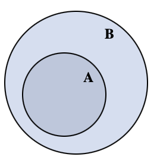

## DATE: 221218
---

## Index

- 221218
    - [추상화](#추상화--abstract)
    - [부품화](#부품화)
    - [은닉화, 캡슐화](#은닉화-캡슐화)
    - [인터페이스](#인터페이스)
    - [리팩토링](#리팩토링)
    - [클래스와 인스턴스 그리고 객체](#클래스와-인스턴스-그리고-객체)
    - [this](#this)
    - [클래스 멤버 인스턴스 멤버 그리고 static, dynamic](#클래스-멤버-인스턴스-멤버-그리고-static-dynamic)
    - [클래스 함수 ( 클래스 메서드 )](#클래스-함수--클래스-메서드)
    - [static field, non static field](#static-field-non-static-field)

---

- 객체지향 프로그래밍 ( OOP: Object Oriented Programming )
- **JAVA는** 다른 언어와 다르게 **객체지향을 사실상 강제한다** ( 라고한다. 공부하다보면 알게 될지도 )

### 추상화 ( Abstract )

- 객체의 대표되고 공통되는 속성과 행위들을 추출하여 정의 내리는 것
    - 컴퓨터라는 객체의 모니터, RAM, SSD, HDD 라는 공통되는 것을 추출하여 컴퓨터를 추상화


### 부품화

- 결함이 있을 때에 분리가 되어 있지 않다면 전체가 영향을 받게 된다. 하지만 부품화가 잘 되어있는 경우 해당 부품만 교체하면 문제가 해결이 되는 장점이 있다
- 객체 지향은 부품화의 정점이라 할 수 있다

### 은닉화, 캡슐화

- 부품의 내부의 동작 과정, 방법은 숨긴채 사용자에게는 부품의 사용 벙법만을 노출
    - 모니터가 어떻게 화면을 출력하는지는 모르지만 사용자는 모니터에 파워를 넣고 컴퓨터에 연결을 하면 사용 할 수 있다는 것만 알면 된다
- 객체 내부에는 어떤 메소드가 있고 어떠한 입출력을 갖고 어떻게 동작하는지는 알려주지 않지만 객체를 사용가능 하도록 하는 것

### 인터페이스

- 잘 만들어진 부품이라면 같은 부품끼리는 서로 교환이 가능해야한다
    - 컴퓨터에 A사 모니터와 B사 모니터 모두가 연결되어야 한다
    - 모니터와 컴퓨터를 연결하는 케이블의 규격이 표준화 되어 있어야 한다
    - 모니터와 컴퓨터의 연결점을 **인터페이스** 라고 한다
- 인터페이스는 부품들 간의 규격을 소프트웨어적으로 구현된 것

### 리팩토링

- 기존의 코드와 동일하게 동작하지만 코드 내용을 개선하여 코드를 효율적으로 만드는 행위
- 자주 리팩토링을 거친 코드는 건강한 코드가 되고 건강한 코드일 수록 변화에 유연하게 대처가 가능하고 버그를 만들 확률이 낮아진다

### 클래스와 인스턴스 그리고 객체

- 어떠한 **객체**를 [추상화](#추상화--abstract) 시키면 **클래스** 그것을 구체화 하면 **인스턴스**
    - 고양이라는 객체를 추상화 시킨다 -> 클래스 생성
        - 고양이의 공통, 특징되는 속성을 뽑아 설계도 생성
        ex) 외형 선택 - 얼룩냥이, 치즈냥이
    <br>

    - 고양이 클래스를 구체화 -> 인스턴스 생성
        - 치즈냥이, 얼룩냥이 생성  
    <br>

    - 고양이라는 객체를 분석해서 설계도를 만들고 그 설계도를 통해 고양이를 구현
    - 고양이라는 객체를 추상화하여 클래스를 생성하고 클래스를 통해 인스턴스 생성

```JAVA
    // 고양이라는 객체를 추상화하여 클래스를 생성
    public class Cat {
        ...
    }

    public static void main(String[] args){

    // Cat 이라는 데이터 타입의 cheese라는 변수에 Cat 클래스를 인스턴스화
    // Cat 이라는 데이터 타입의 spot라는 변수에 Cat 클래스를 인스턴스화
        Cat cheese = new Cat('치즈냥이');
        Cat spot = new Cat('얼룩냥이');
    }
```

### this

- 클래스 내부의 함수에서 선언한 지역변수와 클래스 변수와 변수명이 동일 할 때에 this 를 통해서 지역변수가 아닌 전역변수인 클래스 변수를 사용한다고 명시해 주는 역할
---

**아직 this 와 class, instance 멤버의 개념을 배우지 않았을 때 적었던 내용**

- [인스턴스](#클래스와-인스턴스-그리고-객체) 생성 후 해당 인스턴스 내부에 변수의 값을 초기화 또는 변경 할 때에 함수의 파라미터를 통해 값을 넘긴 후 this.변수명을 통해 데이터를 넣어 준다

 this 를 사용하는 이유는 보통 함수의 파라미터 명과 클래스의 변수명을 동일하게 설정하는데 이 때 함수 내부의 지역변수가 클래스 변수보다 우선 순위로 설정이 되어 클래스 변수의 값이 변경되지 않는다 그래서 this 를 통해 명시해주는 것

```JAVA
    class Test{
        int a;
        // self.a   // Python 사용 시 인스턴스 고유 변수라면
                    // __init__ 선언 후 self 를 붙인 채 생성을 했었던 거 같은데...

        public void setA(int a){
            // this.a = a;
            // a = a;
        }

        public void printA(){
            System.out.println(this.a); // 2 출력
            System.out.println(a);      // 오류가 날 줄 알았지만 2 출력
        }
    }

    public class MyApp {
        public static void main(String[] args){
            Test test = new Test();
            test.setA(2);
            test.printA();
        }
    }
```

- JAVA 의 this와 Python 의 self 가 비슷 한 거 같은데...  
Python 은 함수 내부 지역변수가 아닌 함수 외부 class 변수일 경우 self 를 사용하지 않으면 error 가 출력이 되지만  
JAVA 에서는 함수 파라미터의 변수명과 클래스의 변수명의 같은 경우 this 를 통해 지역변수가 아니고 클래스 변수인 것만 명시 해주면 클래스 변수의 데이터가 바뀐다  
심지어 클래스 변수명과 함수 파라미터의 변수명이 다르다면 this 마저 사용하지 않아도 된다 마치 클래스에서 선언된 변수는 전역변수인 것처럼 동작한다 ( 이유: [static field, non static field](#static-field-non-static-field) )  
물론 Python JAVA 가 이렇게 설계가 된 것인지 혹시, 에디터에서 지원하는 편의 기능인지는 모른다 ( Python: vscode, JAVA: intelij 이다 )

### 클래스 멤버 인스턴스 멤버 그리고 static, dynamic

- 클래스 멤버
    - 같은 클래스를 가진 인스턴스라면 서로 공유를 하게되는 데이터
    - 같은 클래스에서 생성된 두개의 인스턴스가 있을 때에 한 인스턴스에서 변수의 값을 변경하면 나머지 인스턴스의 같은 변수명을 가진 ( static ) 데이터의 값도 변하게 된다
- 인스턴스 멤버
    - 같은 클래스 다른 인스턴스와는 공유하지 않는 본인 인스턴스 고유로 갖게되는 데이터
    - 같은 클래스에서 생성된 두개의 인스턴스에서 한 인스턴스의 변수 값을 변경 시 다른 인스턴스에서는 변경이 되지 않는 자기만의 고유 데이터

- 클래스 멤버의 경우 정적인 ( static ) 을 통해 생성
- 인스턴스가 아닌 클래스 명을 통해서 변수에 접근 ( Test.class_variable = 100 )
- 인스턴스 멤버의 경우 동적 ( dynamic ) 이 default 로 설정되어 있어 static 인 경우에만 명시해주면 된다

```JAVA
    class Test {
        static int class_variable = 0;  // 클래스 멤버
        int instance_variable = 1;      // 인스턴스 멤버
    }

    public static void main(String[] args){
        Test t1 =  new Test();
        Test t2 =  new Test();

        System.out.println(t1.instance_variable);   // 1
        t1.instance_variable = 10;
        System.out.println(t1.instance_variable);   // 10
        System.out.println(t2.instance_variable);   // 1 t1 에서만 변경 t2 와 관계 없다

        t1.print_class_variable();  // 0
        Test.class_variable = 100;  // 인스턴스가 아닌 클래스 명을 통해서 변수에 접근
        t1.print_class_variable();  // 100
        t2.print_class_variable();  // 100
                                    // 같은 클래스의 인스턴스끼리는 공유하는 값이기 때문에 둘 다 바뀜
    }
```

### 클래스 함수 ( 클래스 메서드 )

계산기라는 클래스에서 연산을 할 때에는 연산자 함수를 호출하고 파라미터로 좌항과 우항의 값을 넘겨주면 된다 이는 인스턴스를 굳이 생성해서 할 필요가 없다는 뜻이다  
인스턴스를 생성시 메모리를 추가적으로 소비하게 되고 속도적 측면에서도 손해임으로 클래스 명을 통해 클래스에 직접 접근해서 사용하는게 이득이다

```JAVA
    Calculator.sum(10, 20);
```

### static field, non static field

- 클래스 메소드와 인스턴스 메소드 간의 접근
    - 인스턴스 메소드를 통해 클래스 멤버에 접근이 **가능하다**
    - 클래스 메소드를 통해 인스턴스 멤버에 접근이 **불가능하다**
<br>

- 클래스 자체 변수인 static 클래스 변수는 클래스와 동시에 생성되는 반면에 인스턴스 고유 변수인 dynamic 변수는 인스턴스 객체가 생성되어 메모리에 올라오는 순간 생성이 된다
- 인스턴스 메소드는 인스턴스가 생성 이전부터 존재하던 클래스 멤버에 접근이 가능 - static, non static field 모두 접근 가능
- 하지만 클래스 멤버 생성 당시에는 인스턴스가 생성이 되지 않은 상태임으로 오직 static field 에만 접근이 가능한 상태
- 심지어 클래스 메소드는 static feild 만 접근 가능하도록 **정의 되었기 때문에** 인스턴스가 생성된 이후라도 non static feild 에는 접근이 불가능 하다

A = static field ( 클래스 멤버 )  
B = non static field ( 인스턴스 멤버 )



### 유효범위 ( scope )

- 클래스의 서로 다른 함수에서 선언된 변수의 이름이 서로 같더라도 변수의 유효범위가 다르기 때문에 값에 영향을 끼치지 않는다 ( 동명이인과 같이 단지 이름이 같은 것 )
- [this](#this) 를 통해 클래스 자체 전역변수와 함수 내부의 지역변수 명이 같을 경우 this 앞에 붙여 지역변수가 아닌 전역변수를 사용한다고 명시
<br>

- 클래스 내부에서 선언된 변수 **전역변수**
- 클래스 내부의 함수에서 선언된 변수 **지역변수**
<br>

- 함수의 로직에서 전역변수를 사용할 경우 부품의 관점에서 클래스의 의존성이 너무 커지게 되는데, 이는 객체의 크기가 커짐을 의미하고, 곧 서로간의 연관성이 상승함으로 또 다시 복잡함의 상승을 불러일으키고, 결국 관리의 이슈를 생성하게 됨으로 전역변수를 사용하는 것보다 파라미터를 통해 독립적으로 작동하는게 좋다